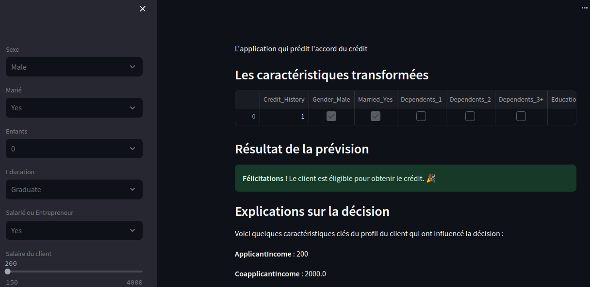

# LoanPredictApp


Welcome to **LoanPredictApp**! This application predicts loan approval based on various client characteristics using a machine learning model. It is built with Python, Streamlit, and several popular data science libraries.

## Table of Contents
- [Introduction](#introduction)
- [Features](#features)
- [Installation](#installation)
- [Usage](#usage)
- [Screenshots](#screenshots)
- [Model Explanation](#model-explanation)
- [Contributing](#contributing)
- [Contact](#contact)

## Introduction

LoanPredictApp is designed to help financial institutions and loan officers quickly assess the likelihood of loan approval. By inputting client information, the application uses a pre-trained machine learning model to predict the approval status.

## Features

- **User-Friendly Interface**: Simple and intuitive interface built with Streamlit.
- **Real-Time Predictions**: Get immediate feedback on loan approval chances.
- **Customizable Parameters**: Adjust client parameters to see how they affect loan eligibility.
- **Insightful Output**: Detailed results and explanations for each prediction.

## Installation

To get started with LoanPredictApp, follow these steps:

1. Clone the repository:
    ```bash
    git clone https://github.com/Vatosoa/LoanPredictApp.git
    cd LoanPredictApp
    ```

2. Create and activate a new conda environment:
    ```bash
    conda create --name loan_predict_app python=3.11
    conda activate loan_predict_app
    ```

3. Install the required packages:
    ```bash
    conda install --file requirements.txt
    ```

4. Run the application:
    ```bash
    streamlit run main.py
    ```

## Usage

Once the application is running, you can input various client details such as income, loan amount, credit history, etc., via the sidebar. The model will then predict whether the client is likely to get the loan approved or not.

## Screenshots

Here's a preview of how LoanPredictApp looks:

### Home Page


## Model Explanation

The machine learning model used in this application is trained on a dataset of loan applications. It takes into account various features like the applicant's income, loan amount, credit history, etc., to make a prediction. The model is based on Logistic Regression, a popular algorithm for binary classification tasks.

For more details on the dataset and the model, refer to the [model documentation](docs/model.md).

## Contributing

We welcome contributions from the community! If you find any issues or have suggestions for improvements, please open an issue or submit a pull request. Here’s how you can contribute:

1. Fork the repository.
2. Create a new branch (`git checkout -b feature/YourFeature`).
3. Commit your changes (`git commit -m 'Add some feature'`).
4. Push to the branch (`git push origin feature/YourFeature`).
5. Open a pull request.

## Contact

For any inquiries or feedback, please reach out to:

- **Author**: Vatosoa
- **Email**: [razafindrazakav@gmail.com](mailto:razafindrazakav@gmail.com)
- **GitHub**: [https://github.com/Vatosoa](https://github.com/Vatosoa)

Thank you for using LoanPredictApp!
